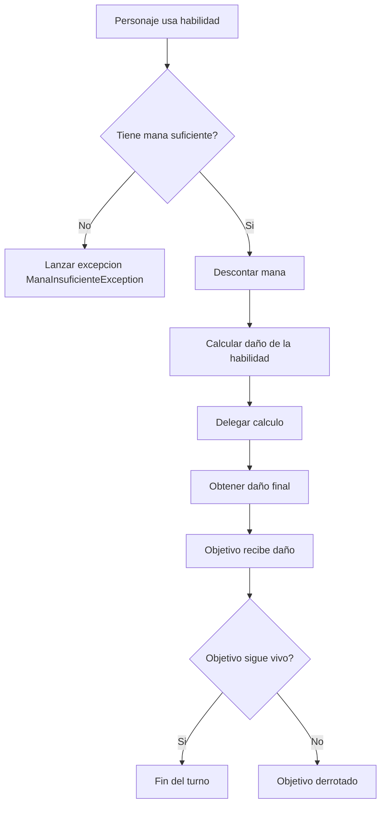
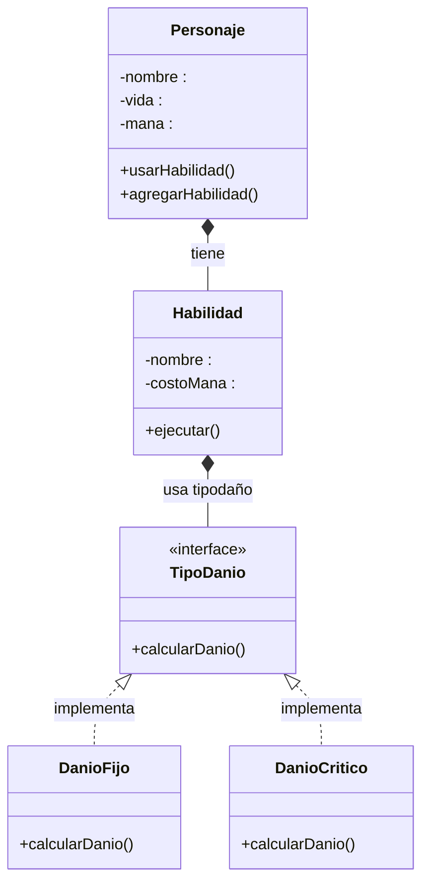

## Explicación

[Interface.php](Interface.php) será la interfaz que heredará el método calcularDanio() a DanioFijo.php y DanioCritico.php.

[DañoFijo.php](DanioFijo.php) Daño recibido desde la habilidad y se retorna sin modificación.

[DanioAleatorio.php](DanioAleatorio.php) debe generar un valor aleatorio (por ejemplo entre 0 y 1) para decidir si el ataque es crítico. Si el ataque es crítico, el daño debe multiplicarse por 1.5; de lo contrario, debe devolver el daño base.

[Personaje.php](Personaje.php) será la clase para crear todos los personajes so el ogro y Gandalf . Los atributos básicos que debe tener son: nombre, vida, mana y habilidades[]. Los métodos estaVivo(), usarHabilidad(), aprenderHabilidad() y recibirDanio().

[Habilidad.php](Habilidad.php) debe tener los atributos básicosde nombre, costoMana, danñoBase y tipoDaño. Este último será el objeto que implementa el tipo de daño usando las clases de daño. Debe incluir los getters y el método calcularDanio(), que será el encargado de delegar el cálculo del daño a la clase correspondientede DanioCritico o DanioFijo.

## Flujo



## Posibles mejoras

Subir de nivel si el jugador realiza ataques críticos.

## Posibles Preguntas

1. ¿Qué pasa si quiero que los ataques ya no tengan posibilidad de crítico de aquí en adelante?
2. ¿Cómo aumentar las posibilidades de crítico de forma global o individual?

## UML



## Ejemplo de Objetos

```PHP
$gandalf = new Personaje("Gandalf", 100, 80);
$orco    = new Personaje("Orco", 120, 30);

$pistolita = new Habilidad("pistolita", 20, 50, new DanioFijo());
$puñete = new Habilidad("puñete",1, 1, new DanioAleatorio());

$gandalf->aprenderHabilidad($puñete);

```
