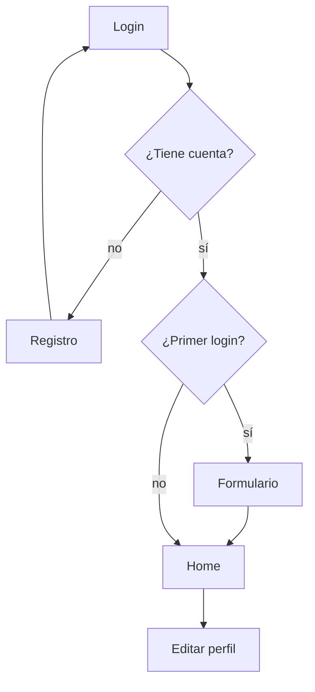
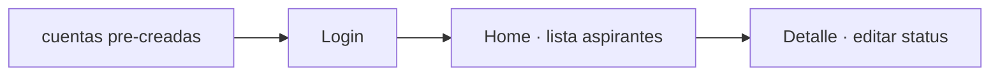

## Rutas

### Aspirante

| URL           | Descripción                            |
| ------------- | -------------------------------------- |
| `/login`      | Inicio de sesión                       |
| `/registro`   | Crear cuenta nueva                     |
| `/formulario` | Llenar datos personales (primer login) |
| `/home`       | Panel del aspirante                    |
| `/perfil`     | Editar información personal            |

### RRHH

| URL                | Descripción                   |
| ------------------ | ----------------------------- |
| `/rh/login`        | Inicio de sesión RH           |
| `/rh/home`         | Lista de todos los aspirantes |
| `/rh/detalle/{id}` | Ver detalle y cambiar estado  |

# Sistema de Registro de Aspirantes

Sistema web en PHP para gestionar el registro y evaluación de aspirantes por parte de Recursos Humanos.

---

## Estructura del proyecto

```
parcial-02/
├── public/                  ← Document root (único acceso desde el navegador)
│   ├── index.php            ← Punto de entrada de la app
│   ├── .htaccess            ← Redirige todo a index.php
│   └── assets/
│       └── css/
├── config/
│   └── Conexion.php         ← Conexión a BD
├── core/
│   ├── App.php              ← Arranca la aplicación (sesión, constantes, router)
│   ├── Router.php           ← Enrutador central GET/POST
│   └── Security.php        ← Guards de autenticación y perfil
├── controller/
│   ├── AspiranteController.php  ← Vistas y acciones del aspirante
│   └── RhController.php         ← Vistas del panel de RH
├── models/
│   ├── Usuario.php          ← Login y registro de usuarios
│   └── Perfil.php           ← CRUD del perfil del aspirante
└── view/
    ├── aspirante/           ← Vistas del aspirante
    ├── rh/                  ← Vistas del panel RH
    ├── partials/            ← Componentes reutilizables (navbar, paises)
    └── errors/              ← Páginas 404, 403
```

---

## Base de datos

### Tabla `usuario`

| Columna         | Tipo       | Descripción                  |
| --------------- | ---------- | ---------------------------- |
| id              | INT PK AI  | ID interno                   |
| id_usuario      | VARCHAR    | Nombre de usuario (único)    |
| contrasena      | VARCHAR    | Hash Argon2id                |
| perfil_completo | TINYINT(1) | 0 = incompleto, 1 = completo |

### Tabla `perfil`

| Columna          | Tipo      | Descripción                                    |
| ---------------- | --------- | ---------------------------------------------- |
| id               | INT PK AI | ID del perfil                                  |
| id_usuario       | INT FK    | Referencia a `usuario.id`                      |
| cedula           | VARCHAR   | Cédula o pasaporte                             |
| nombre           | VARCHAR   |                                                |
| apellido         | VARCHAR   |                                                |
| estado_civil     | VARCHAR   | Nullable                                       |
| genero           | VARCHAR   |                                                |
| tipo_sangre      | VARCHAR   | Nullable                                       |
| fecha_nacimiento | DATE      |                                                |
| nacionalidad     | VARCHAR   |                                                |
| telefono         | VARCHAR   |                                                |
| residencia       | VARCHAR   |                                                |
| correo           | VARCHAR   |                                                |
| estado           | VARCHAR   | `no_revisado`, `considerado`, `no_considerado` |

---

## Flujo de la aplicación

### Aspirante



### RRHH



## Enrutamiento

Todo pasa por `public/index.php` → `App::run()` → `Router::dispatch()`.

El router detecta si la petición es GET o POST y llama al método correspondiente del controlador:

| Método HTTP | URL              | Método del controlador                   |
| ----------- | ---------------- | ---------------------------------------- |
| GET         | /login           | `AspiranteController::login()`           |
| POST        | /login           | `AspiranteController::post_login()`      |
| GET         | /registro        | `AspiranteController::registro()`        |
| POST        | /registro        | `AspiranteController::post_registro()`   |
| GET         | /formulario      | `AspiranteController::formulario()`      |
| POST        | /formulario      | `AspiranteController::post_formulario()` |
| GET         | /home            | `AspiranteController::home()`            |
| GET         | /perfil          | `AspiranteController::perfil()`          |
| POST        | /perfil          | `AspiranteController::post_perfil()`     |
| GET         | /rh/home         | `RhController::home()`                   |
| GET         | /rh/detalle/{id} | `RhController::detalle($id)`             |

Las URLs con prefijo `/rh/` van al `RhController`. Todo lo demás va al `AspiranteController`.

---

## Seguridad

- Contraseñas hasheadas con **Argon2id** (`password_hash` / `password_verify`).
- `session_regenerate_id(true)` al hacer login para prevenir session fixation.
- `Security::requireAspiranteAuth()` protege todas las rutas privadas.
- Las carpetas `config/`, `controller/`, `models/`, `view/` están bloqueadas desde `.htaccess`.
- `htmlspecialchars()` en todas las salidas de datos del usuario.
- Consultas con **PDO + prepared statements** en todos los modelos.

---

## Agregar una nueva ruta

1. Agrega el método GET en el controlador:

    ```php
    public function mipagina(): void {
        Security::requireAspiranteAuth();
        require BASE_PATH . 'view/aspirante/mipagina.php';
    }
    ```

2. Si necesita POST, agrega el método con prefijo `post_`:

    ```php
    public function post_mipagina(): void {
        // lógica...
        header("Location: /home");
        exit;
    }
    ```

3. Crea la vista en `view/aspirante/mipagina.php`.

4. El formulario apunta a la misma URL:
    ```html
    <form method="POST" action="/mipagina"></form>
    ```

No hay que tocar el Router.
